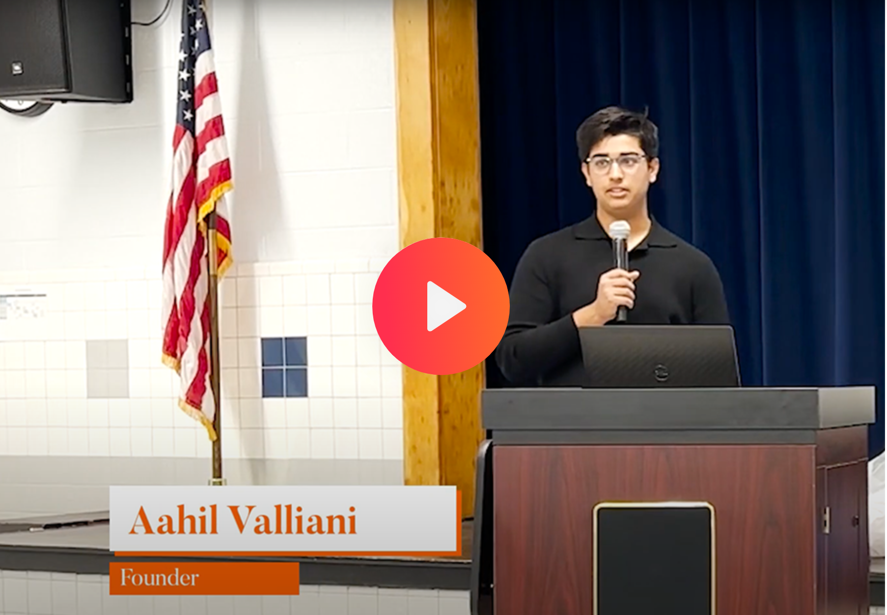

<p align="center">
  <a href="https://safekids.ai">
    <picture>
      <source media="(prefers-color-scheme: dark)" srcset="logo.png">
      
    </picture>
    <h1 align="center">safekids.ai</h1>
  </a>
</p>

<p align="center">
  <a aria-label="License" href="https://creativecommons.org/licenses/by-nc-sa/4.0/deed.en">
    
  </a>
  <a aria-label="NPM" href="https://www.npmjs.com/search?q=%40safekids-ai">
    
  </a>
</p>

## About safekids.ai and what we are all about
[](https://www.youtube.com/watch?v=E7vhpFryVAc)


## Incredible ML models and Applications in one Mono Repo
We have opensourced our Toxic Language and Vision Models (Guns and Adult) along with multiple applications like the
gmail-extension that was deployed to thousands of kids to change their cyber-bullying behavior.

<!-- !toc (minlevel=2 omit="Table of Contents") -->

* [Use our Toxic Language and Vision Models](README_ml.md)
* [Gmail Extension for Toxic Speech](apps/gmail-extension/README.md)
* Web Filter to Kids Using Advanced AI and Mental Health Framework (awaiting release)
* Network Proxy Filter for Windows that runs are the Kernel Level (awaiting release)

### License
Modified Creative Commons Attribution-NonCommercial-ShareAlike 4.0 International License
https://creativecommons.org/licenses/by-nc-sa/4.0/deed.en

Key Modifications:
Please use the code for educational and non-profit purposes. Any commercial use (for profit or a commercial entity)
should ask for explicit permission from us to use the codecase. 

The most important request is to modify this codebase to make it better. Any modifications
you do, please commit back to this repository. I think that's only fair to improve the overall
software. 

&copy; Safe Kids LLC, 2024
```plaintext
All rights reserved. No part of this publication may be reproduced, 
distributed, or transmitted in any form or by any means, including photocopying, 
recording, or other electronic or mechanical methods, without the prior written 
permission of the copyright owner, except in the case of brief quotations embodied 
in critical reviews and certain other noncommercial uses permitted by copyright law.
```
