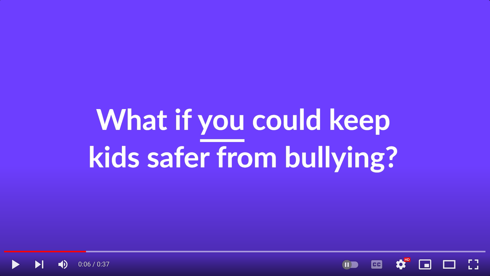

# Gmail extension detects hate speech

Most advanced AI powered email filter that helps kids identify bullying for both incoming and outgoing emails

## Download for Chromestore

## See the code here
https://github.com/safekids-ai/ml-models/tree/main/apps/web-category-extension

## How an email is flagged for incoming email

## How we make the kids change their behavior and make them change their hateful message

## Our research on deploying the extension across thousands of students

