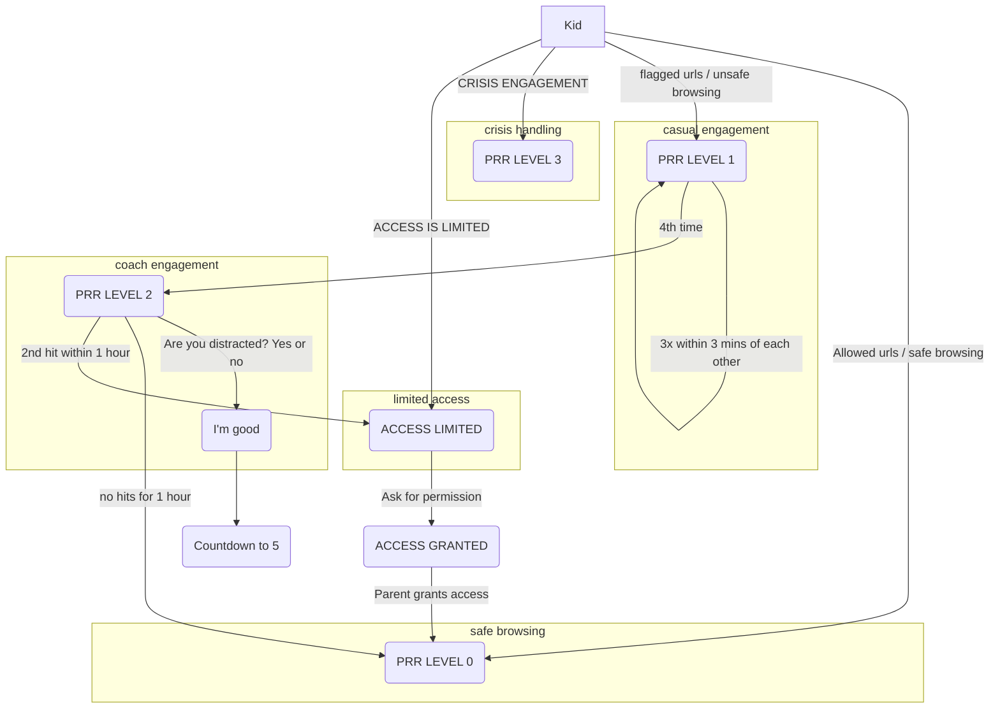

```mermaid
graph TD
A[Kid] -->|Allowed urls / safe browsing| B(PRR LEVEL 0)
A --> | flagged urls / unsafe browsing | C(PRR LEVEL 1)
C --> | 3x within 3 mins of each other| C
C --> | 4th time | D(PRR LEVEL 2)
D --> | Are you distracted? Yes or no | I(I'm good)
I --> | | J(Countdown to 5)
D --> | no hits for 1 hour | B
D --> | 2nd hit within 1 hour | E(ACCESS LIMITED)
E --> | Ask for permission | G(ACCESS GRANTED)
G --> | Parent grants access | B
A --> | CRISIS ENGAGEMENT | F(PRR LEVEL 3)
A --> | ACCESS IS LIMITED | E
subgraph casual engagement 
C
end
subgraph coach engagement
D
I
end
subgraph crisis handling
F
end
subgraph safe browsing
B
end
subgraph limited access
E
end
```

- can go to some listed sites when access is limited
- crisis handling has highest priority over everything else
- 
